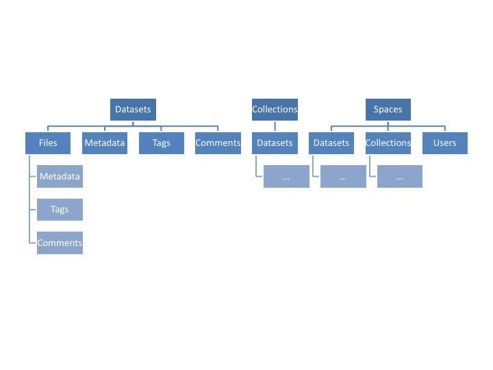
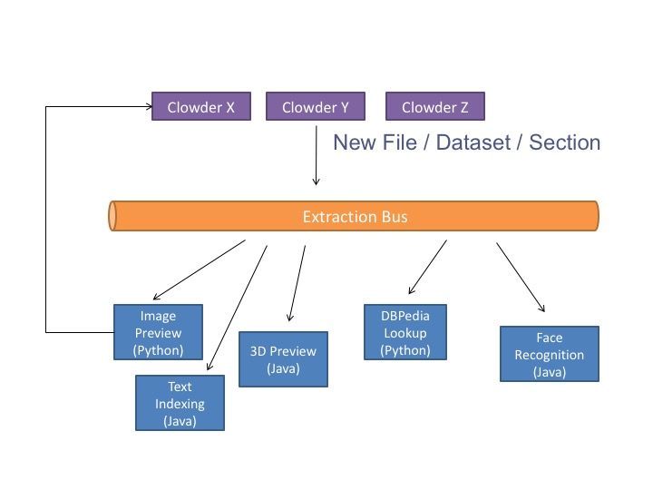

Architecture
============

Information in Clowder is organized using the following data model:

Clowder uses a variety of technologies to accomplish its goals. The overall architecture of a typical deployment looks
as follows:

.. image:: _static/architecture.jpg

The web application and individual extractors comprise most of the custom Clowder code and the core of the system.
Most of the other blocks in the diagram are external services Clowder depends on. The next section covers how to
setup a typical stack.

When new data is added to the system, whether it is via the web interface or through the RESTful API, preprocessing is
off-loaded to extraction services in charge of extracting appropriate data and metadata. The extraction services attempt
to extract information and run preprocessing steps based on the type of the data just uploaded. Extracted information
is then written back to the repository using appropriate API endpoints.

For example, in the case of images, a preprocessing step takes care of creating the previews of the image, but also of
extracting EXIF and GPS metadata from the image. If GPS information is available, the web client shows the location of
the dataset on a map embedded in the page. By making the clients and preprocessing steps independent the system can
grow and adapt to different user communities and research domains.