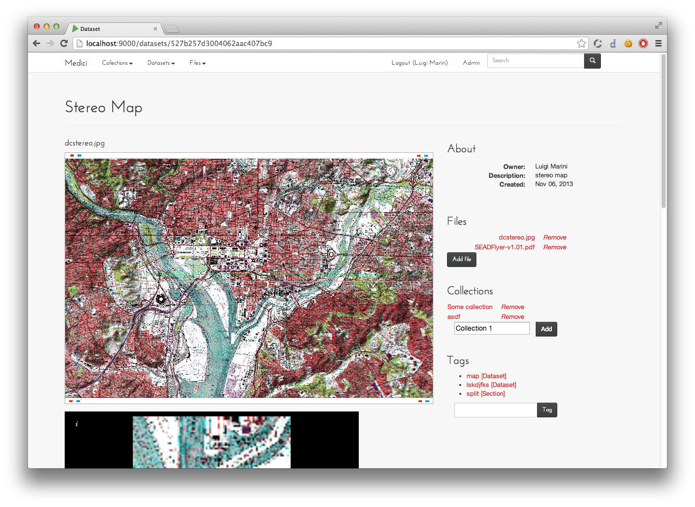

Clowder
==================================

Medici is a web-based content management system that allows users to share, annotate, organize and analyze large
collections of datasets. Unlike other CMS, Medici focuses on unstructured data in the form of arbitrary files and
structured data in the form of metadata associated with the files.

Contents:

.. toctree::
   :maxdepth: 2

   overview
   installation
   source
   setup
   api

Indices and tables
==================

* :ref:`genindex`
* :ref:`modindex`
* :ref:`search`

