.. index:: Collections
Collections
============

Collections are a user defined group of datasets and other collections. 

Creating a Collection
---------------------

Similarly as a dataset, a collection can be created from the home page, the top navigation page, within the collection list or within a space. 
 
To create a collection from the home page click on the 'Create Collection' button below your name in the links section. Displayed in blue in the next image. 

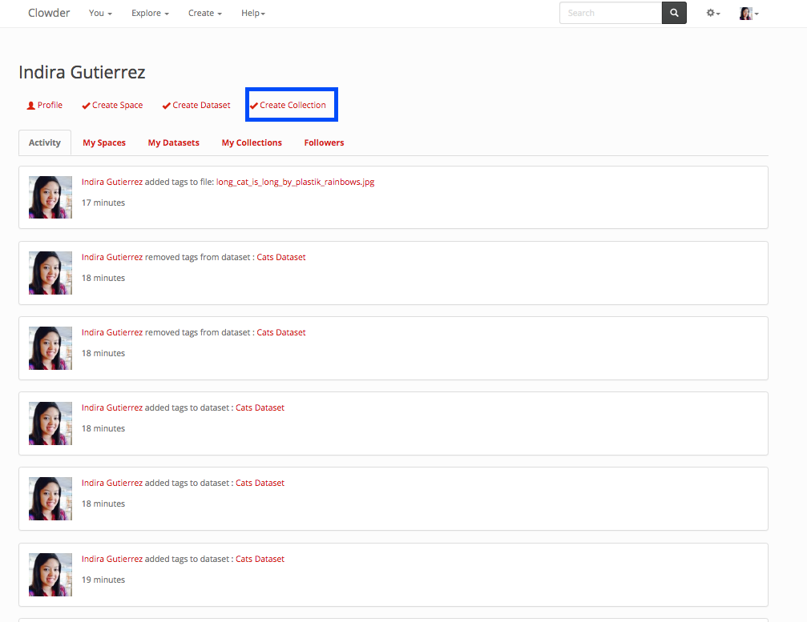

To create a collection from the top navigation. Click in the create dropdown in the top navigation displayed in blue in the next image. Next click in collections displayed in green in the next image. 

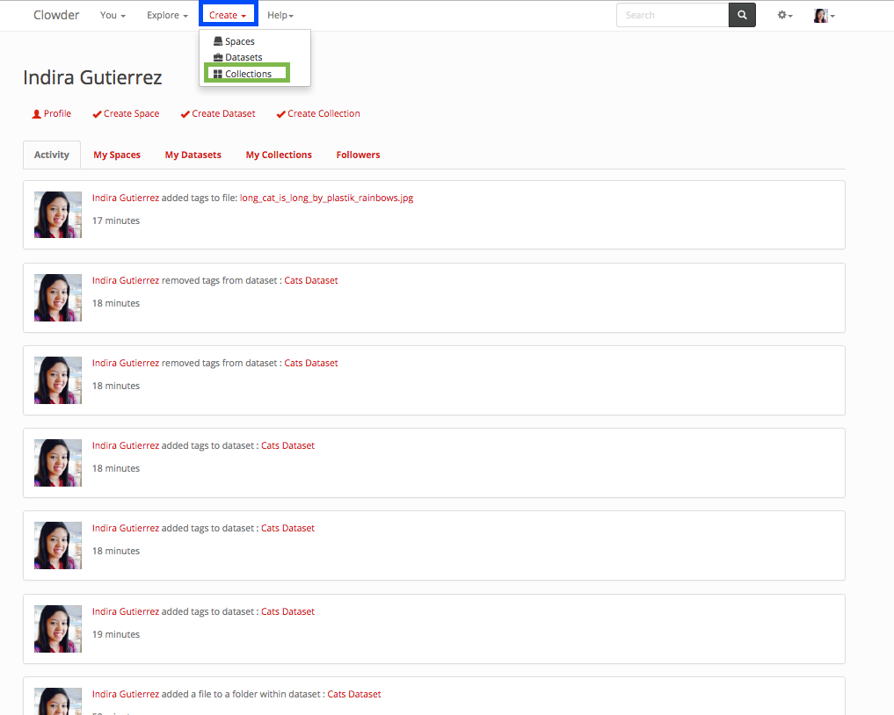

To create a collection from the list of collections page click on the create button in the top right. The list of collections is displayed below.
 
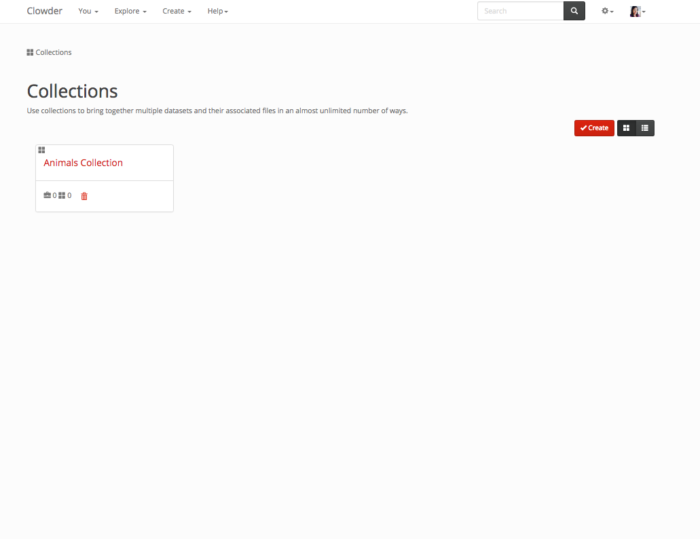

To create a collection within a space, go into the space and click on the create collection button displayed in the image below within a blue box.

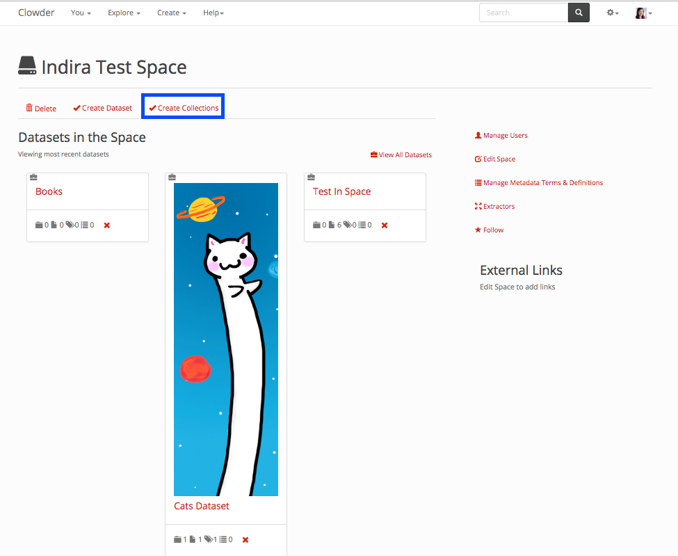

A collection  has a name, description and space. The name field is the only required field. After you start the creating process for a collection with any of the above methods. A page like the one in the image is below. Once you have input the information that you want for your space. You can click on the create collection button at the end of the page, and you will be redirected to your new collection page. 

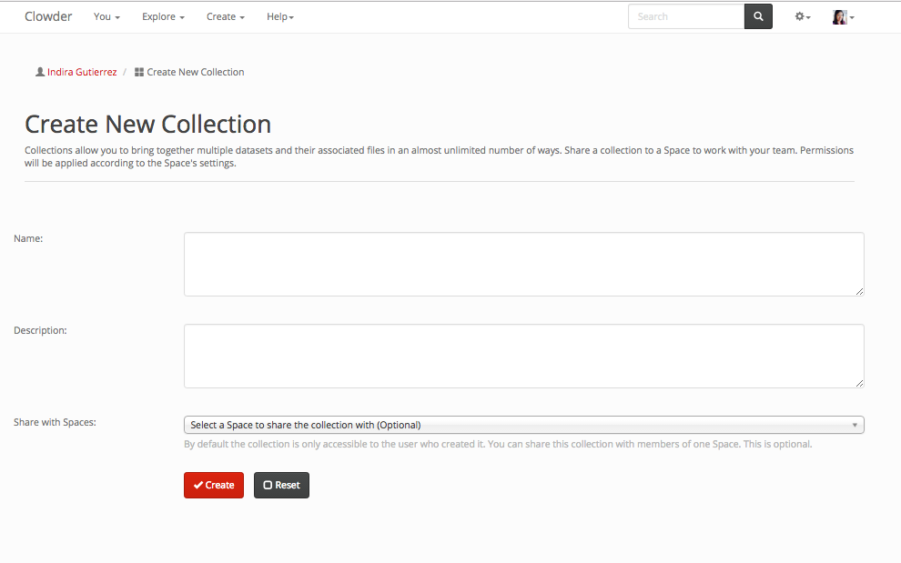

Editing a Collection
---------------------

In a collection, you can edit the name and the description. In order to do so, hover over the collection name or description and an edit symbol will show up. The button that shows up is displayed within a blue box on the next image.

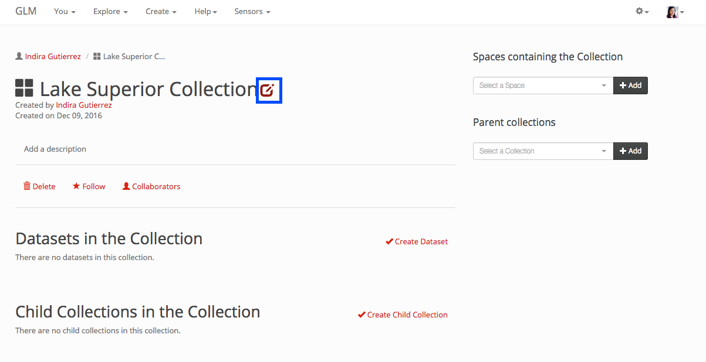
 
On click it will show an input field with the current name which you can update and then click on the save button. A similar behavior exists for the description field. 

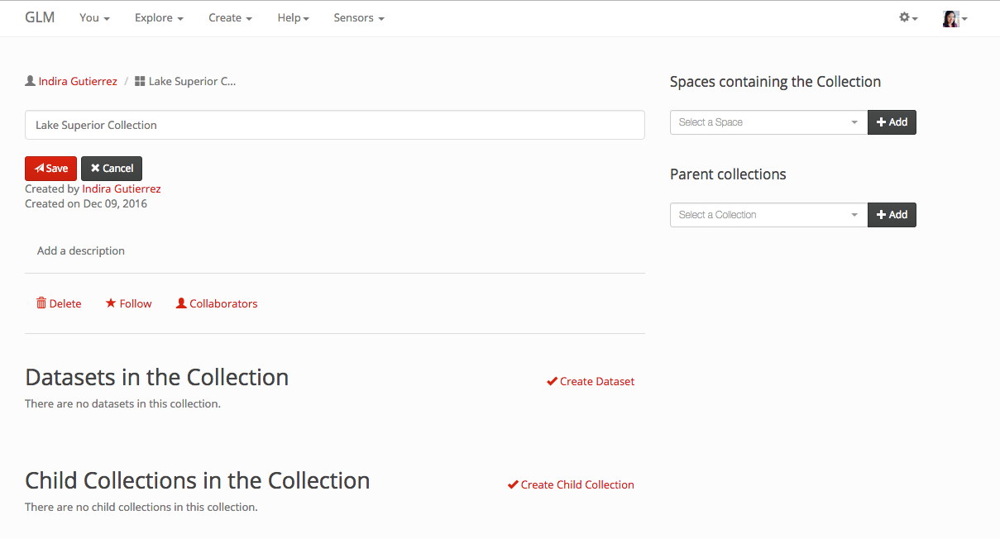

Adding Datasets to a Collection
-------------------------------

If you want to add a new dataset to  a collection, you can create it within the collection page by clicking the create dataset button highlighted in the image below.

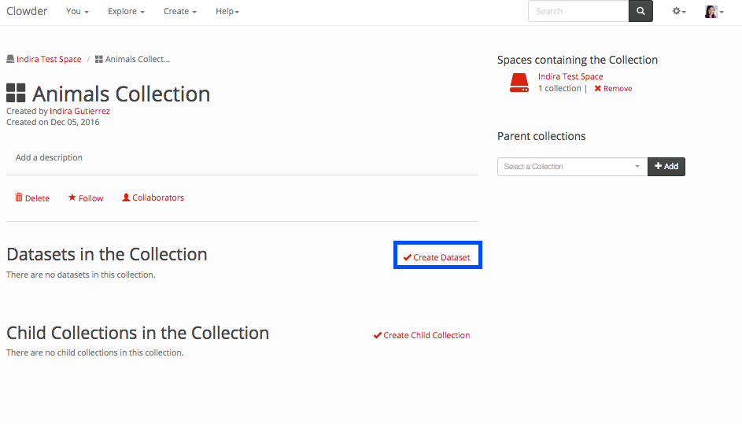

You can create a dataset as indicated in the instructions on the dataset section. 

If you want to add an existing dataset to a collection, you need to go into the datasets page. In the right navigation there is a section called 'Collections containing the dataset' where a list of the collections that a dataset is part of will show up, if it is part of a collection. At the end, there is a dropdown that will show the collections you can add the dataset to. You can select one and click on the Add button. The section where you can add a dataset to a collection is highlighted below in a blue box. 

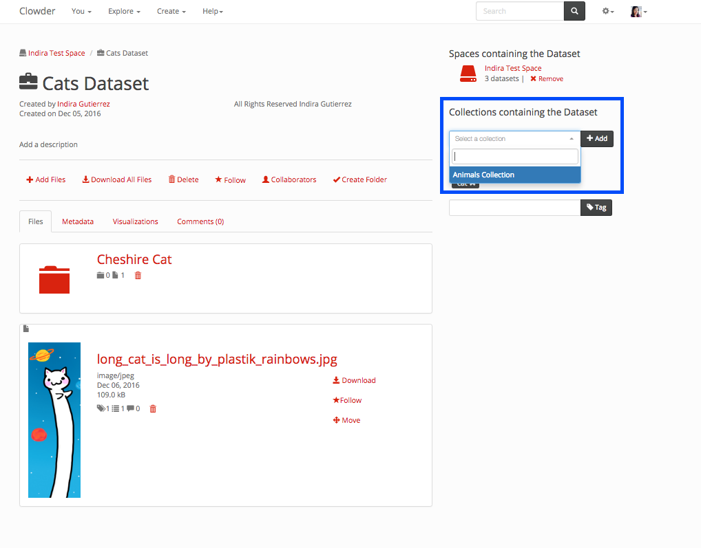
 
Removing a Dataset from a Collection
------------------------------------------

You can remove a dataset from a collection within the dataset page or within the collection page. 

To remove a dataset from the dataset page, In the right navigation in the 'Collections containing the dataset' you can click on the remove button next to the collection you want to remove the dataset from. The remove link is highlighted in the next figure. 

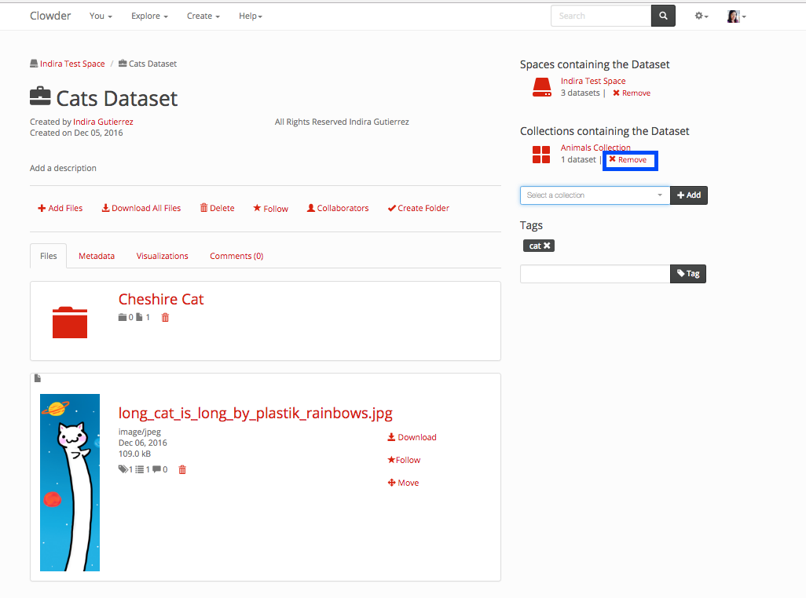

To remove a dataset from the collections page, in the list of dataset, you can click on the remove button in the dataset list item. The button is highlighted in the image below with a blue box. 

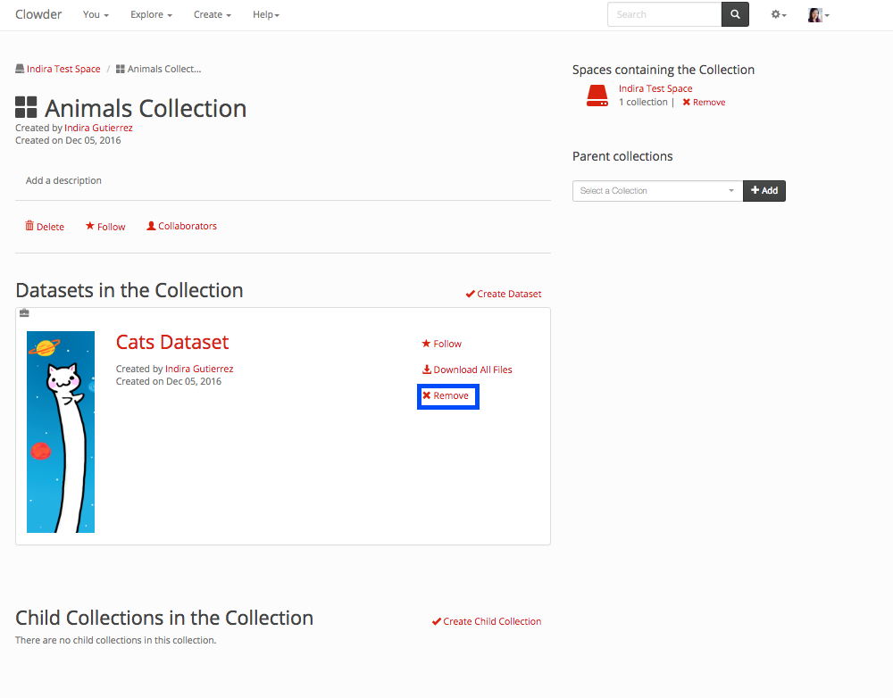

Creating Child Collections 
--------------------------

Child collections are a way to organize collections in a hierarchical way. You can create new child collections within a collections page. Collections created this way inherit the spaces that the parent collection is currently on. Child collections do not show up on the listing of collections to avoid cluttering, but they do show up as collections that you created in the home page. You can not remove child collections from a space that has been inherited from a parent collection.  You can also add existing collections to a parent collection. If the child collection was on a space that the parent collection was not in, you will be able to remove the child collection from that space. 

To create a child collection within a collection page. Click on the 'Create Child Collection' button in the Child Collections in the Collection section. The button is highlighted in a blue box in the next image. 

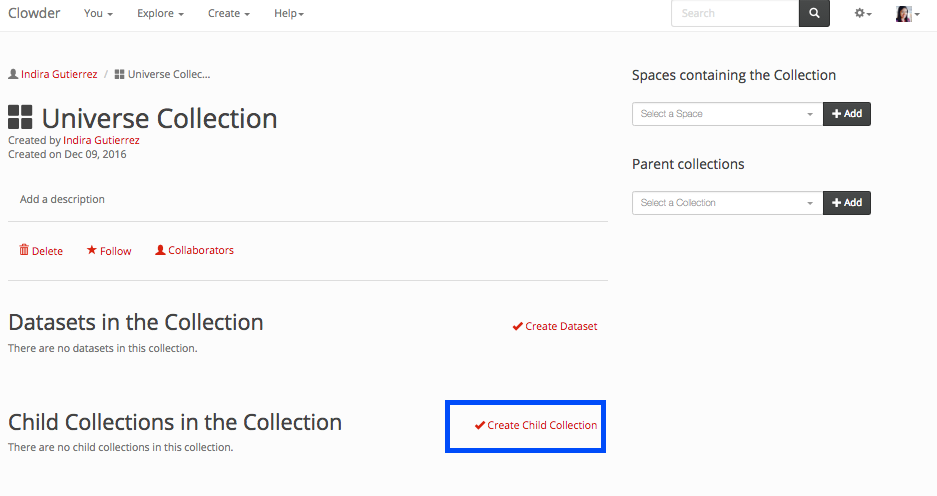

The Create Child Collection page looks as below. It is a little different than creating a collection page, because it cannot be added to a space directly. It will inherit the spaces from the parent collection. After adding a name and optional description you can click on the create button in the bottom. 

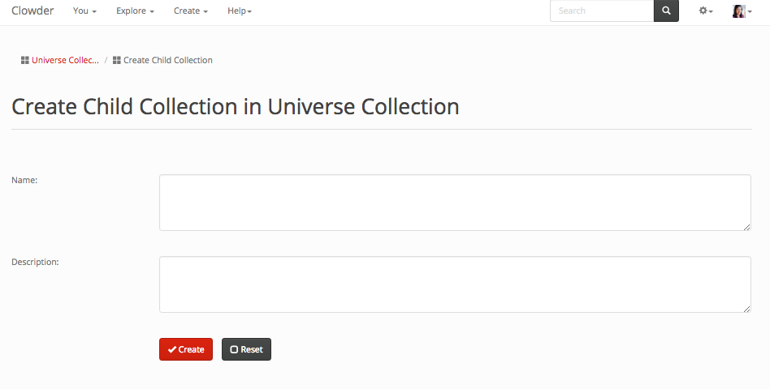

To add an existing collection to a parent collection. You can click in the dropdown in the 'Parent Collections' area in the right navigation of the collection page. After selecting a collection from the dropdown, click on the Add button next to it. The Parent Collections area is highlighted in a blue box in the next image. 

.. image:: _static/ug_collections-14.png
    :width: 750px

Removing a Child Collection
---------------------------

A child collection can only be removed from within the parents collection page. In the listing of Child Collections within the collection page, click on the remove button on the tile for the corresponding collection. In the next image the remove button for the child collection is highlighted. 

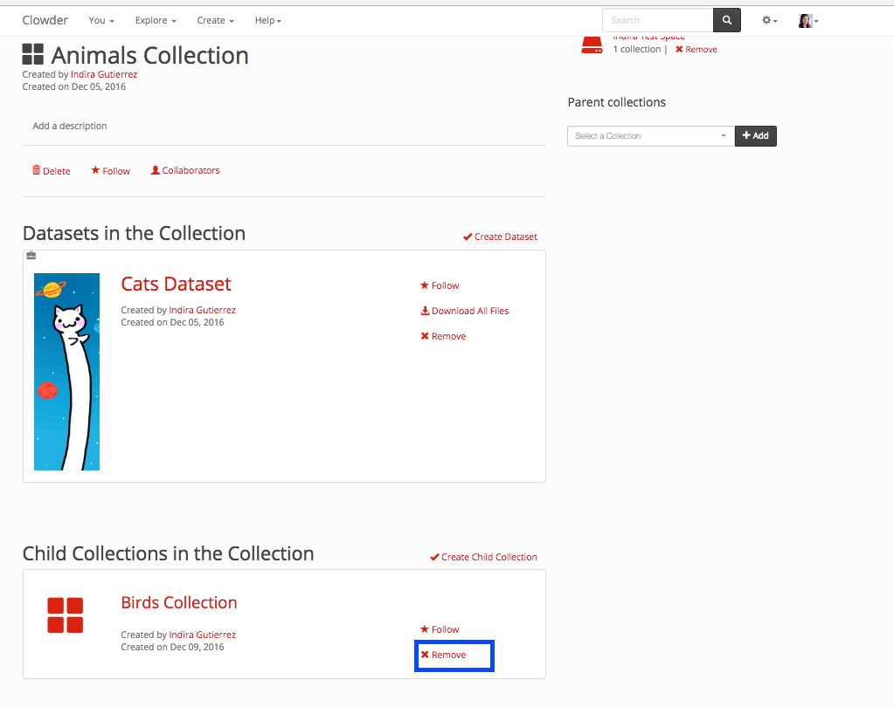

Adding to a Space
---------------------

You can add an existing collection to a space by going to the collection page and clicking on the dropdown in the 'Spaces containing the Collection' section, selecting the space you want to add the collection to and then clicking on the Add button next to it. 

The section where you can add a collection to a space is highlighted by a blue box in the next image. 

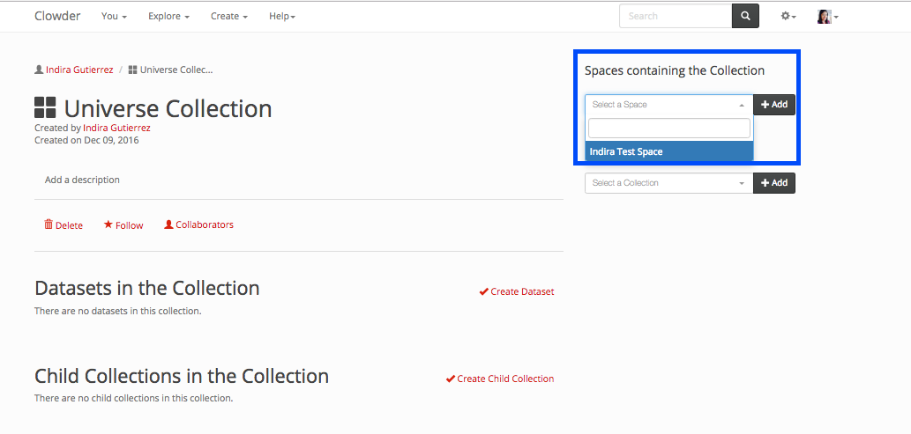

Removing from a Space
---------------------

A collection can be removed from a space within the collection page or within the space page. 
To remove the collection within the collection page, click the 'Remove' button next to the space you want to remove it from. This is highlighted in the next image with a blue box.

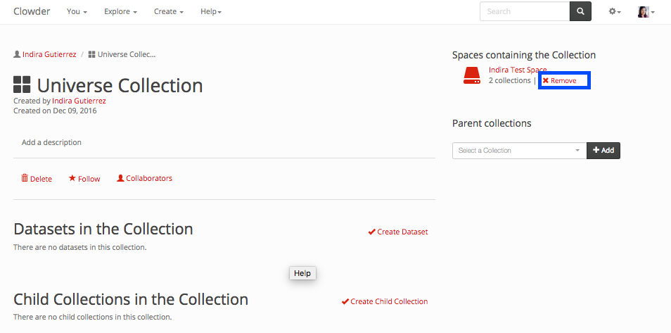

In a space page, go to the collection tile that you want to remove and click on the x button within the tile. The x  button's for collections are highlighted in the image below with a blue box. 

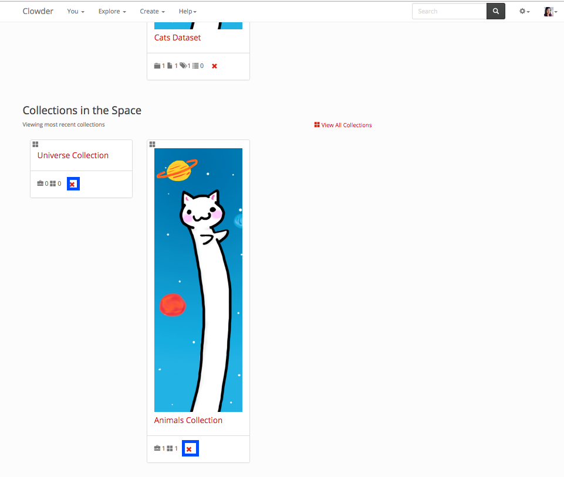

Deleting a Collection
---------------------

If you want to completely delete a collection from Clowder, you can do so within the collection itself, on the collection list, or if you created the collection from the home page. 

Within the collection, page click on the Delete button displayed below in a blue box. 

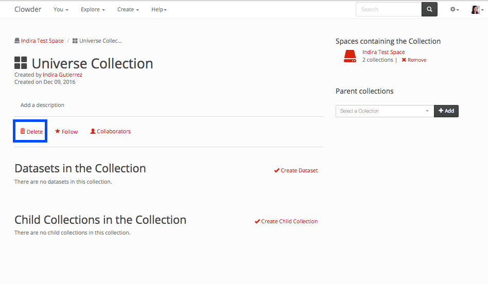

To delete a collection from the collection list page, click on the trash button within the tiles. They are highlighted below in blue boxes. 

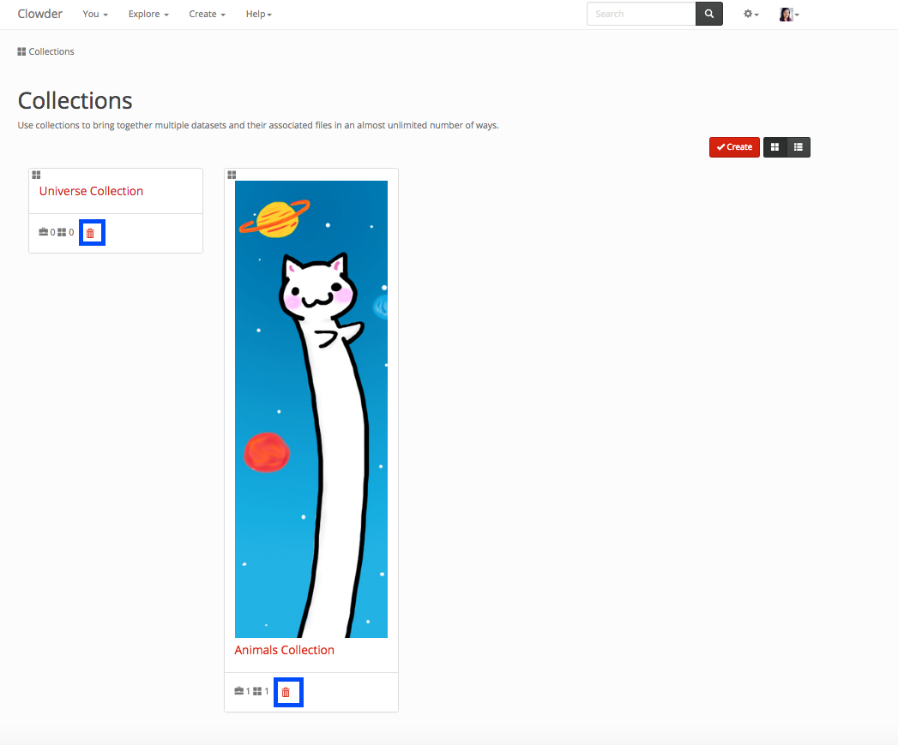
 

If you created a collection, you can delete them from your home page. Go into the 'My Collections' tab displayed below with a blue surrounding box. And then click on the trash can icon in the collection you want to delete, highlighted in green in the image below.

.. image:: _static/ug_collections-21.png
    :width: 750px
 
