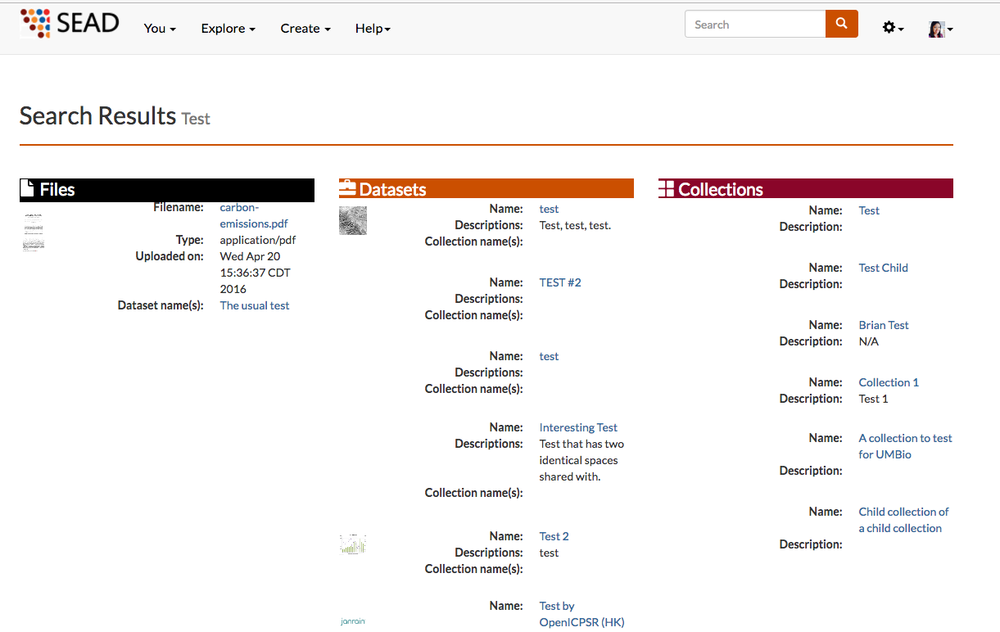

.. index:: Search
Search
=======

In Clowder, you can search datasets, collections and files by name and description. To do so, just input the string you want to look for in the search box on the top right. As indicated in the image below with a blue box and click on the search button next to it or click enter. The image below also shows a sample result of a search.

