.. index:: Spaces
Spaces
========

A space is a group of collections, data sets, and files with defined user access rights. Spaces are used to share data within datasets and collections with other users. There are different permissions assigned to each role. The 3 most common roles are Admins, Editors, and Viewers. In summary,  a viewer can only see the datasets, files and collections within a space. An editor, besides the view privileges can add new datasets and collections to the space, as well as remove them, it can also edit the datasets and collections within the space. An admin can do what an editor does and also edit the space itself, invite and remove people from the space, edit the extractor available. Note: Roles are customizable there is a section below about permissions and roles. 

 
Creating a Space
----------------

You can create a space from your home page, by clicking on the button in the blue box below 

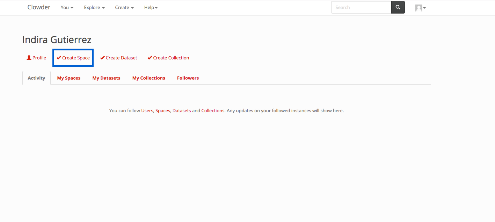

Or using the create dialog in the top navigation. Click on the Create dropdown in the top navigation (in blue on the image below) And then select Spaces (in green in the image below)

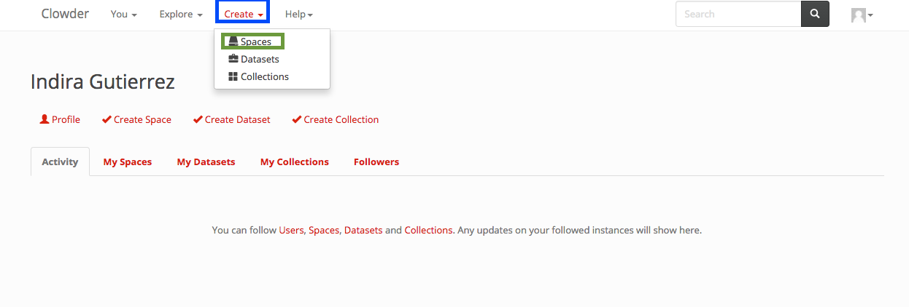

Or within  the space list page. Click on the Create button in the top right of the page. (The list spaces page is accessed by clicking on Explore > Spaces)

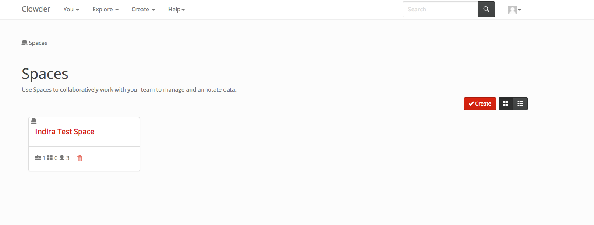

After starting the create process by either of the 3 methods above you can start creating your space by filling up the information in the next figure (The only required field is the name). 

.. image:: _static/ug_spaces-4.png
    :width: 750px

You click on the create button at the end of the page and are then redirected to the space page. 

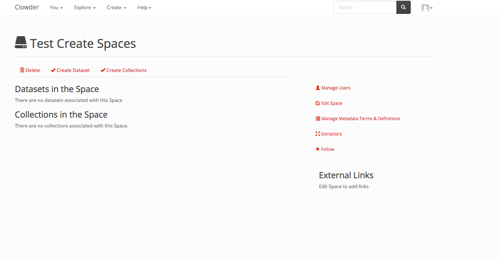
 
 
Editing a Space
---------------

You can edit the name, description, external links, logo and banner for your space at any time. To do so, click on the Edit Space button highlighted in blue in the figure

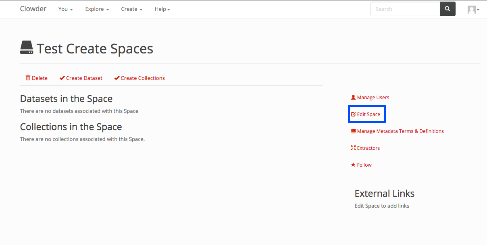

Then you can edit the values and click on the update button in the bottom.

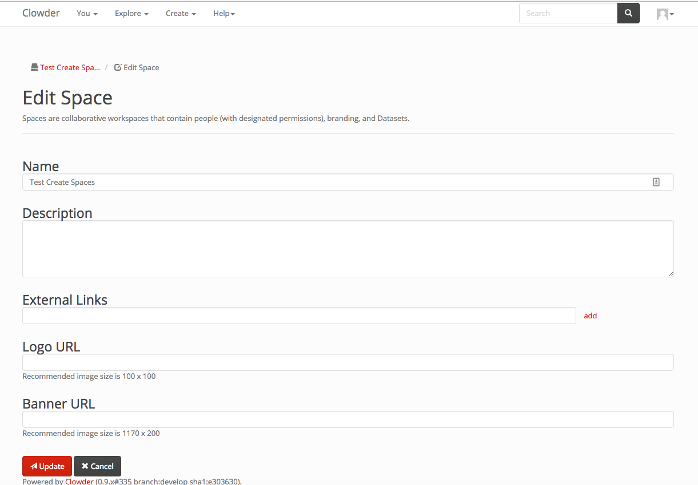
 
 
Inviting Users and Adding users to a Space
------------------------------------------
 
When you want to invite users to collaborate in your space, you can invite them by email if they don't have an account on Clowder, and if they have an account on Clowder you can add them to your space. 
In order to do so, in the space page click on the Manage Users button in the right column, as marked by the blue box in the next figure.

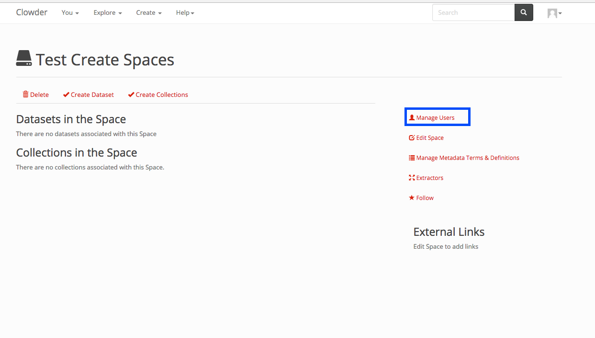
 
After clicking on the link above, the screen below shows up. You can click on either of the 3 roles select fields, and when you do so, the list of all the members of clowder not in the space show up. You can select them. And after selecting all the people you want in the different roles you click on the submit button at the end of the page. In this page, you can also remove current members, there is an x next to each current member of the space. When you click on the x, the member is removed from the space (no need to click on submit).

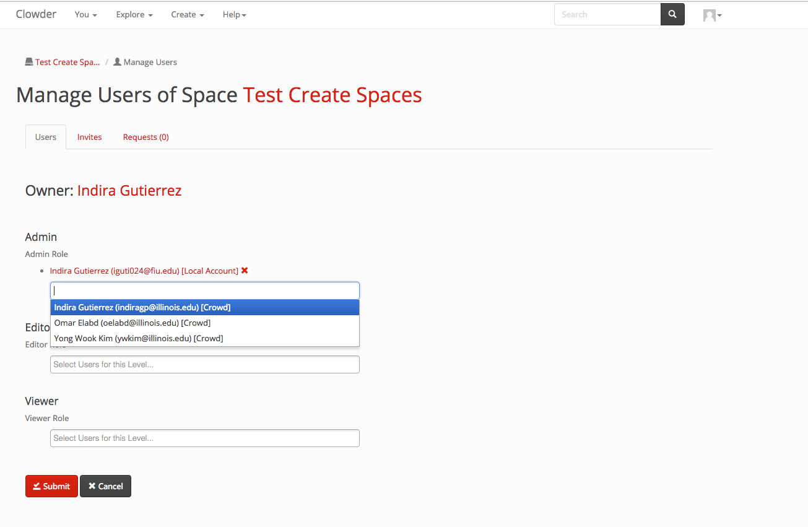
 
To invite people by email, click on the Invite shown in a blue box in the image below.
 
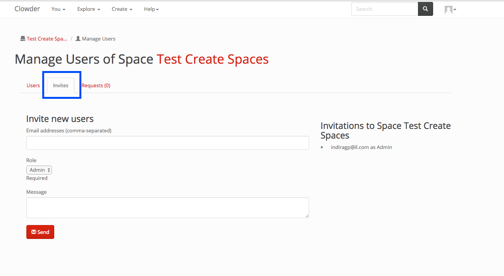

You can fill up the emails for the users you want to invite, select the role and an optional message. The people you invite will get a link to register to clowder and will get added to your space once they join clowder. The current invites you have out for people show up in the right with the roles they were invited as. 

List of All Spaces
------------------

To access a list of all the spaces, you click on the explore button in the top navigation (in blue in the next screenshot). And then click on the spaces button (in green in the next screenshot). The list of all available spaces in the space will be displayed. 
 
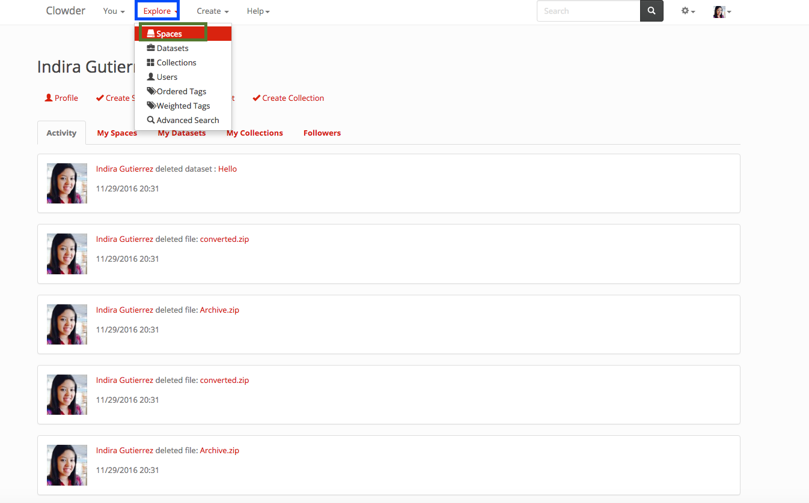

Requesting and Granting Access to a Space
------------------------------------------
 
If there is a space that you would like to participate in, but you are not a part of, you can request access to it. In the space page you click on the button pointed by the green arrows in the image below. 
 
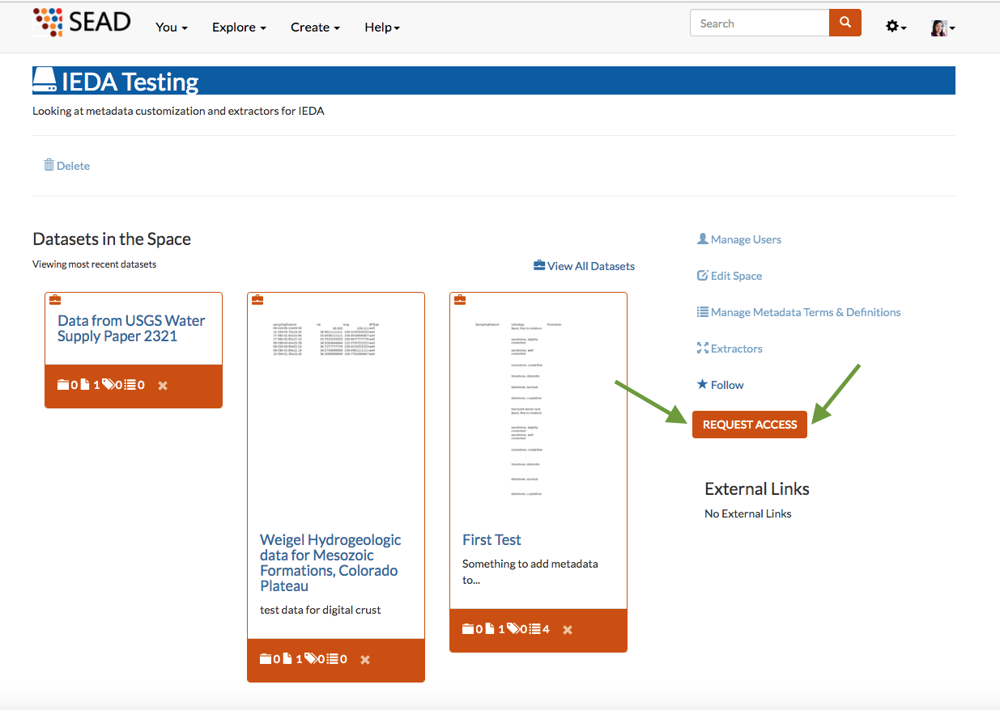

When you submit your request, the admins of the space will get an email and can then accept you to the space. 
 
To accept people that have requested access to one of your spaces. You first go to the space and then click on the Manage Users (as when inviting people above) 

Deleting a Space
----------------

A space can be deleted within the list of spaces or inside the space itself. If you are also the creator of the space you can delete it from your home page. 
To delete a space from the list of the space. Go to the list of spaces, as indicated above, click on the explore dropdown in the top navigation, then select spaces. If you have the right permissions to delete the space the delete button will be enabled. In the screenshot below the delete button is shown in a blue box for the 2nd space. 

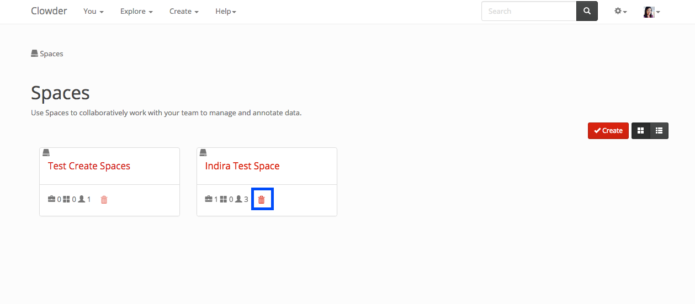

You can click on a space within the list of spaces, or the home page and when you are on the space itself, you can click on the delete button indicated by a blue box surrounding it in the next picture

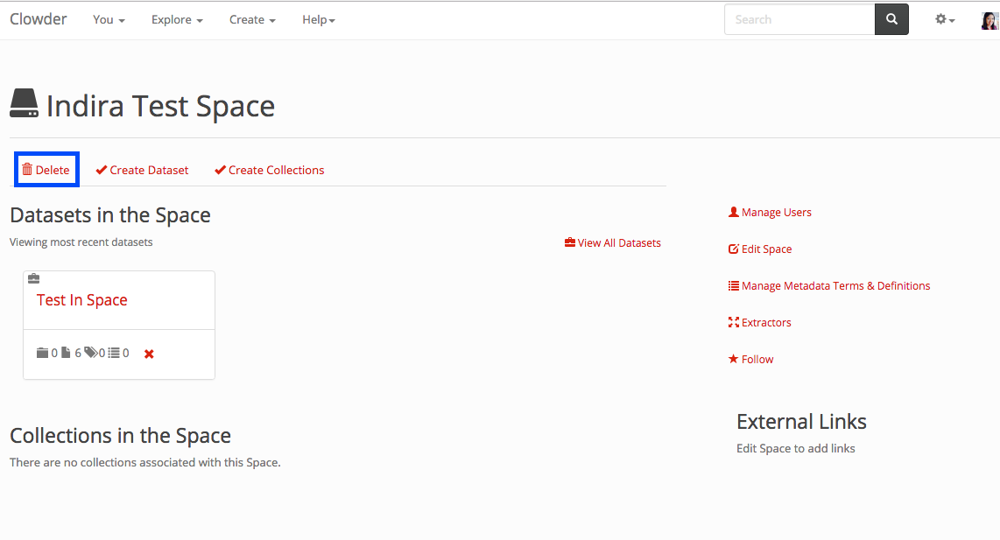
 
If you are the creator of the space you want to delete, you can go to the home page, click on the my spaces tab and delete like in the first scenario. The spaces tab is highlighted in blue in the next picture and the delete button in green. 

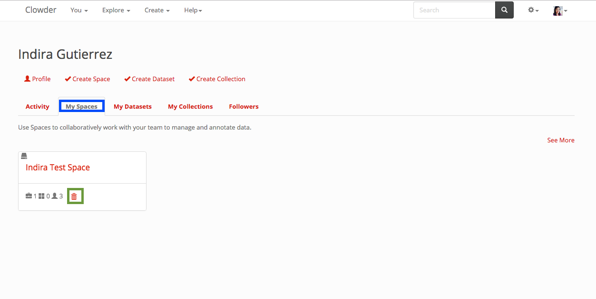
