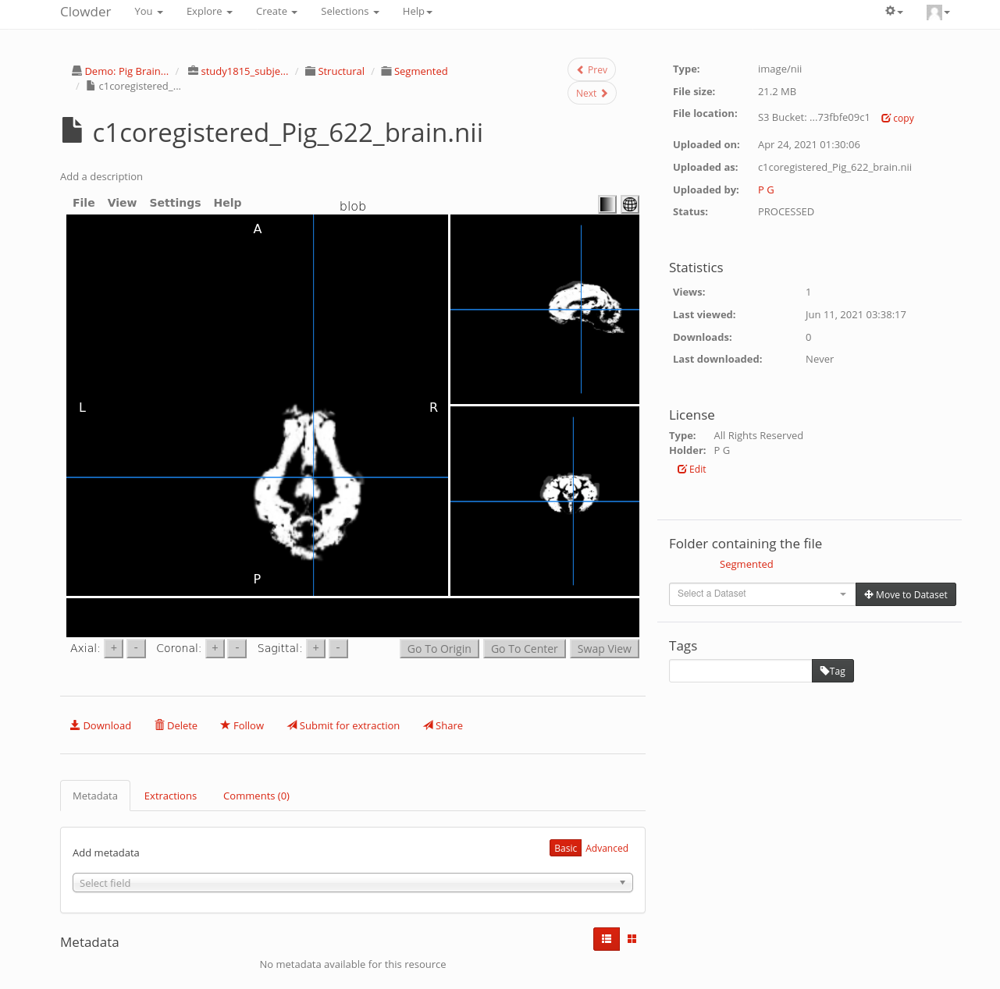

#MRI previewer based on the Papaya JS library

## Papaya Library
Papaya is a javascript component for viewing MRI images. This integration only
currently supports NIFTI images (.nii and .nii.gz files).

Homepage: https://rii-mango.github.io/Papaya/
Live demo: https://papaya.greenant.net/
Source: https://github.com/rii-mango/Papaya

## Clowder Previewer



TODO: Support for DICOM images is possible, but the integration is harder b/c
a single DICOM volume is a directory full of image files which must be queried
for through Clowder and then fed to the jquery component.

## Build

The assets in this previewer (clowder/public/javascripts/previewers/mri-papaya)
can be replicated with the following procedure. The BUILD_SHA below is from May 5, 2019, which
was the HEAD of the project's `master` branch as of April 15 2021. 

Note that the `-nojquery` flag must be included or it will bundle a version of jquery that is
incompatible with Clowder's.

```
BUILD_SHA=782a19341af77a510d674c777b6da46afb8c65f1
git clone git@github.com:rii-mango/Papaya.git
cd Papaya
git checkout $BUILD_SHA
./papaya-builder.sh -nojquery
```

The assets will then be in the `build/` directory

